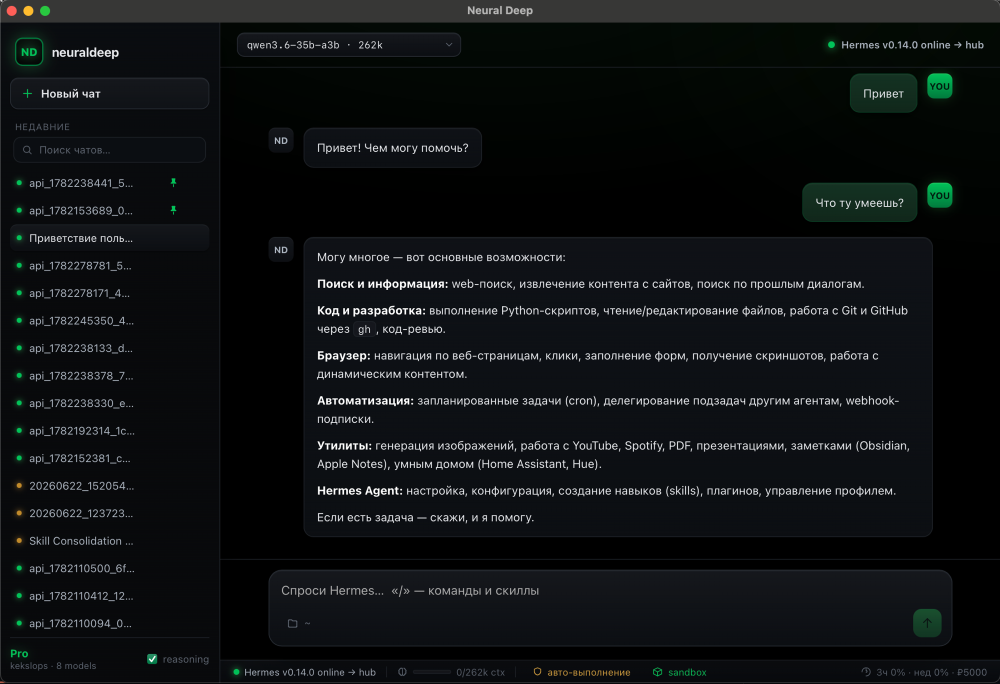
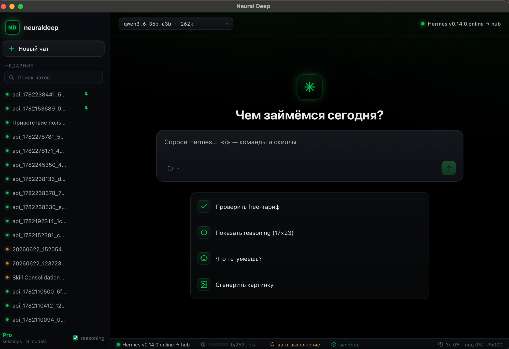

# Neural Deep Desktop

**A very light desktop wrapper over a full-power agent harness.**





Hermes Agent is the **core** (memory, skills, planning, orchestration). It pulls in
**ndcode** (NeuralDeepCode — your MIT fork of opencode) as the coding worker when needed.
Both route every model call through **one** OpenAI‑compatible proxy (the NeuralDeep hub).
The desktop itself is a thin **Tauri** shell — chat + minimal settings — that spawns and
manages the backend.

```
┌─ Neural Deep.app  (LIGHT WRAPPER — Tauri ~10 MB) ───────────────────────┐
│   Thin shell: streaming chat (SSE) + minimal settings. Spawns backend.  │
│      │ HTTP + SSE                                                       │
│      ▼                                                                  │
│   FULL HARNESS (provisioned into app-data on first run):               │
│     Hermes Agent (official, headless) ──skill "ndcode"──▶ ndcode run    │
│      │                                                                  │
└──────┼──────────────── both → one proxy ───────────────────────────────┘
       ▼
   NeuralDeep hub  (OpenAI-compatible: one base URL + key)
```

## North star

- **Full harness, thin wrapper.** Users get the *complete* Hermes + ndcode power, not a
  stripped toy. The wrapper stays minimal and fast.
- **Hermes is the brain.** ndcode is a tool Hermes calls — not a peer. This is Hermes'
  native pattern (it ships an opencode orchestration skill).
- **One proxy.** Hermes and ndcode both point at the NeuralDeep hub. Centralized models,
  keys, routing, cost.
- **Easy to package.** Light installer (Tauri shell + ndcode native binary + `uv`); the
  heavy Python harness is provisioned on first run, not stuffed into the installer.
- **MIT all the way down → sellable** under our own brand. See `THIRD_PARTY_LICENSES.md`.

## Component verdict (build-vs-adopt)

| Layer | Decision | Source |
|-------|----------|--------|
| Core harness | **Adopt** official `NousResearch/hermes-agent` (Python, MIT), run headless | upstream |
| Backend launch/transport | **Lift** the backend layer from `fathah/hermes-desktop` (MIT) — provisioning + SSE chat; drop its Electron UI | `fathah/hermes-desktop` |
| Coding worker | **Adopt** `vakovalskii/NeuralDeepCode` (ndcode, MIT fork of opencode) via a Hermes skill | your repo |
| Model proxy | **External** NeuralDeep hub (OpenAI-compatible) | yours |
| Desktop wrapper | **Build** thin (lift the Tauri shell + Developer ID signing from `NeuralDeskApp`) | ours |

## Status: native Tauri desktop app running ✅

The thin wrapper runs as a **native Tauri desktop app** over the **full Hermes harness**,
with model calls routed through the **NeuralDeep hub free tier**. Proven end-to-end in the
native window (Rust host → Hermes `:8642` → `api.neuraldeep.ru/v1` → streamed back) —
see [`tauri-window-chat.png`](tauri-window-chat.png) (native) and
[`neuraldeep-desktop-devrun.png`](neuraldeep-desktop-devrun.png) (browser dev).

```bash
hermes gateway                          # full Hermes backend → OpenAI API on :8642
cd app && bun install && bun run tauri:dev   # native "Neural Deep" window (Rust host)
# or, browser-only dev: bun run dev    → http://127.0.0.1:5173
```

The Tauri **Rust host** (`app/src-tauri/`) spawns/supervises the Hermes gateway and streams
chat into the webview over a `Channel` — Rust is the trusted loopback client, so no
CORS/Origin gate and the key never reaches the frontend.

- **App:** [`app/`](app/) — thin React/Vite chat shell ([`app/README.md`](app/README.md)).
- **Backend spec:** [`docs/reference/hermes-backend.md`](docs/reference/hermes-backend.md) (transport, single proxy, integration).
- **Packaging/signing:** [`docs/reference/packaging.md`](docs/reference/packaging.md) · **Verification + Q1–Q10:** [`docs/reference/verification.md`](docs/reference/verification.md).
- **ndcode skill:** [`skills/ndcode/SKILL.md`](skills/ndcode/SKILL.md) (headless coding worker, installed into `~/.hermes`).
- **Licensing:** [`THIRD_PARTY_LICENSES.md`](THIRD_PARTY_LICENSES.md) — all-MIT/Apache/PSF, sellable as Neural Deep.

Resolution status (open questions Q1–Q10, end-to-end gate) is consolidated in
[`docs/reference/verification.md`](docs/reference/verification.md). Signing notarization and
live ndcode delegation remain ship-time follow-ups; the dev-run goal is met.
